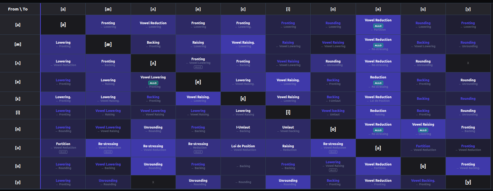

# EchoDrift

**The Universal Atlas of Phonetic Evolution**

> *Can every speech sound transform into every other — in some language, at some point in history?*

EchoDrift started as an experiment to answer that question. The hypothesis: **Any-to-Any** — fill an IPA matrix with documented phonetic shifts and see if every sound pair is connected by at least one historical transformation. (The repo is still named `a2a` because the creator couldn't decide between "Any-to-Any" and "All-to-All". An LLM settled the naming debate by calling it EchoDrift. The matrix lives on.)

The hypothesis turned out to be nearly correct — especially for vowels, where the entire vowel-to-vowel matrix is filled **except for one pair: [ʌ]↔[y]**. We dare you to find a language with that shift.

EchoDrift is an interactive, open-source IPA matrix documenting **phonetic shifts, phonetic drifts, and allophones** across 90+ language families — from Grimm's Law (Proto-Indo-European [p]→Germanic [f]) to Arabic emphasis spreading, Russian akan'ye, and the English Great Vowel Shift. Every cell is backed by academic sources; cells without a documented transformation are explicitly marked with "X", not left blank.



*The vowel-to-vowel matrix. Almost every cell is filled. The two dark X cells are [ʌ]↔[y] — the last frontier.*

## What's in the Atlas

- **1600+ documented phonetic transformations** across consonants, vowels, diphthongs, and allophones
- **90+ language families** — Germanic, Romance, Semitic, Sino-Tibetan, Austronesian, Niger-Congo, Mayan, and more
- **Allophone documentation** with ALLO badges distinguishing synchronic variants from diachronic shifts
- **Commonality heatmap** — cell color intensity reflects how frequently each shift occurs cross-linguistically
- **Unattested cells** marked with "X" — researched, not just missing

## Features

- **Interactive IPA Matrix**: A clickable, cross-referenced table of phoneme-to-phoneme transformations.
- **Keyboard Navigation**: Full support for navigating the matrix via arrow keys and selecting via Enter.
- **Enhanced Search**: Instant search for shifts by name, process type (e.g., "lenition"), language, or IPA symbol.
- **Phonetic Shift Details**: Each cell links to a dedicated page with preamble, linguistic examples, process tags, and scholarly citations.
- **Dynamic SEO & Social Previews**: Optimized OpenGraph and Twitter metadata for every individual transformation page.
- **Inverse Detection**: If A→B is documented, the B→A cell automatically links back.
- **Matrix Modes**: Symmetric, Vowel-to-Consonant (v2c), and Consonant-to-Vowel (c2v) views.
- **Accessibility**: Built with ARIA roles and labels for screen reader compatibility.
- **Academic Sources**: Google Scholar, Google Books, CyberLeninka, JSTOR, and specialized linguistic databases.

## Architecture

EchoDrift uses a **GitHub-as-Database** model:
- **Manifest**: `public/data/index.json` tracks all registered symbols and transformations, including bundled metadata for ultra-fast initial matrix rendering.
- **Cells**: Each documented shift is a standalone JSON file in `public/data/transformations/`.
- **Static Hosting**: Designed for optimized performance on GitHub Pages using React and Hash Routing.

## Development

EchoDrift is built with **React**, **TypeScript**, and **Vite**.

### Automated Indexing

The project uses a custom script to bundle transformation metadata into the main manifest. This is handled automatically during development and build:

```bash
# Manually rebuild the data index
npm run rebuild-index
```

### Running Locally

```bash
# Install dependencies
npm install

# Start development server (auto-rebuilds index)
npm run dev
```

### Building for Production

```bash
# Build and bundle for production
npm run build
```

## Agent Skills

EchoDrift includes a specialized **Gemini CLI skill** to assist with linguistic research and data population.

- **Skill Name**: `echodrift-researcher`
- **Location**: `.gemini/skills/echodrift-researcher/`
- **Purpose**: Automates the search for historical sound shifts using Google Scholar/CyberLeninka and ensures new data adheres to the strict project schema.

To activate the skill in your Gemini session:
```bash
gemini skill activate echodrift-researcher
```

## Community Contributions

EchoDrift is intended to be a growing atlas. If you have examples of phonetic transformations, references, or corrections, contributions are highly encouraged!
